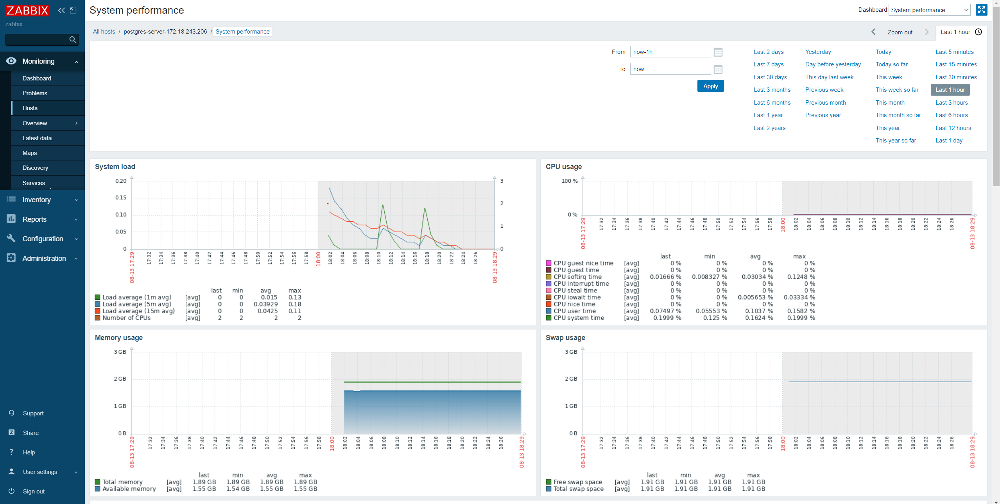
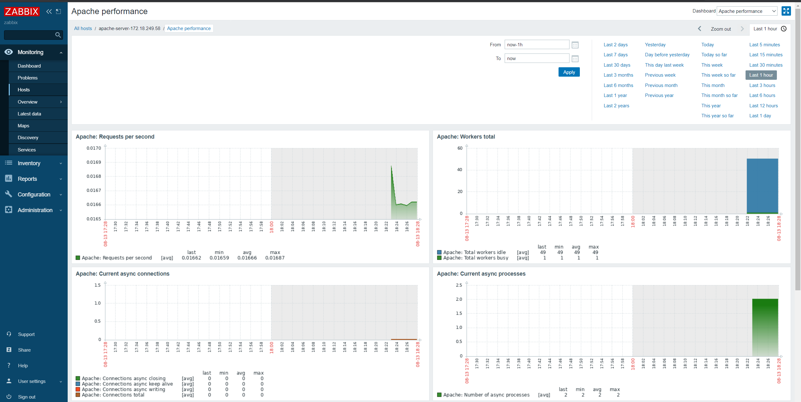
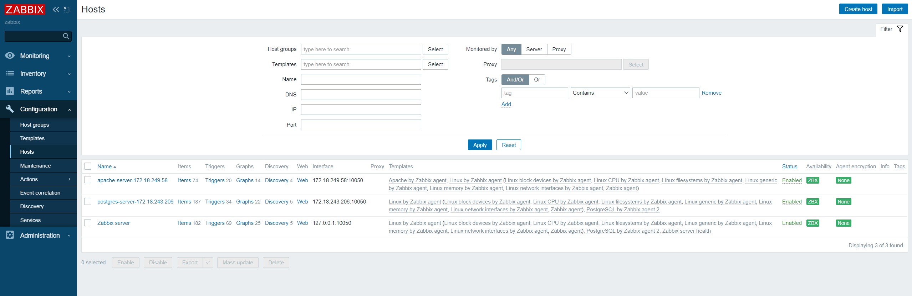

# Zabbix example environment

This is a project that launch a example environment of the motorization system called [Zabbix](https://www.zabbix.com/) for testing purposes using [Vagrant](http://www.vagrantup.com). It would help you learn how to use Zabbix in your local computer.

The example environment includes:

- Zabbix server (Debian 10): Zabbix Server 5.2, Apache and PostgreSQL 12 with TimescaleDB.
- Postgres example server (Debian 10): PostgreSQL 12 and Zabbix Agent 5.2.
- Apache example server (Debian 10): Apache HTTPD 12 and Zabbix Agent 5.2.

<p float="left">
  
  
  
</p>

## What is Zabbix?

Zabbix is an open-source monitoring software tool for diverse IT components, including networks, servers, virtual machines (VMs) and cloud services. Zabbix provides monitoring metrics, among others network utilization, CPU load and disk space consumption. Much more information is available on the [Zabbix web site](http://www.zabbix.com).

## Requisites

- [VirtualBox](https://www.virtualbox.org/manual/) or [Hyper-v](https://docs.microsoft.com/virtualization/hyper-v-on-windows/quick-start/enable-hyper-v).
- [Vagrant](http://www.vagrantup.com).

## How do I run?

1. Open a terminal. If you are using Windows and Hyper-V, you must use a terminal with admin privileges.

2. Clone repository:

```bash
git clone https://github.com/alvsanand/zabbix-example-environment
cd zabbix-example-environment
```

3. Start Zabbix server:

```bash
cd server

vagrant up
```

4. Get Zabbix server IP:

```bash
# Copy value of "HostName"
vagrant ssh-config
```

5. Set Zabbix server environment variable:

```bash
# UNIX
export ZABBIX_SERVER=PREVIOUS_IP

# Windows
set ZABBIX_SERVER=PREVIOUS_IP
```

6. Start Postgres example server:

```bash
cd .. && cd postgres-server
vagrant up
```

7. Start Apache example server:

```bash
cd .. && cd apache-server

vagrant up
```

8. Open Zabbis Dashboard from http://IP_ZABBIX_SERVER using default credentials user ```Admin``` and password ```zabbix```.

8. Configure auto-registration in Zabbix:
    - Add auto registration trigger: Configuration -> Action -> Autoregistration actions -> Create actions:
      - Postgres:  
        - Conditions:
          - "Host name" contains "postgres".
        - Operations:
          - "Add host"
          - "Link Template host" for templates "Linux by Zabbix agent" and "PostgreSQL by Zabbix agent 2"
      - Apache:  
        - Conditions:
          - "Host name" contains "apache".
        - Operations:
          - "Add host"
          - "Link Template host" for templates "Linux by Zabbix agent" and "Apache by Zabbix agent"
